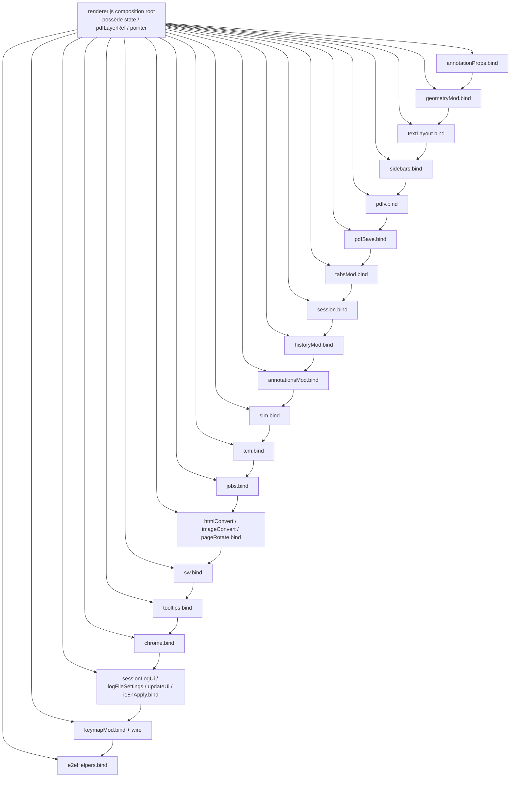
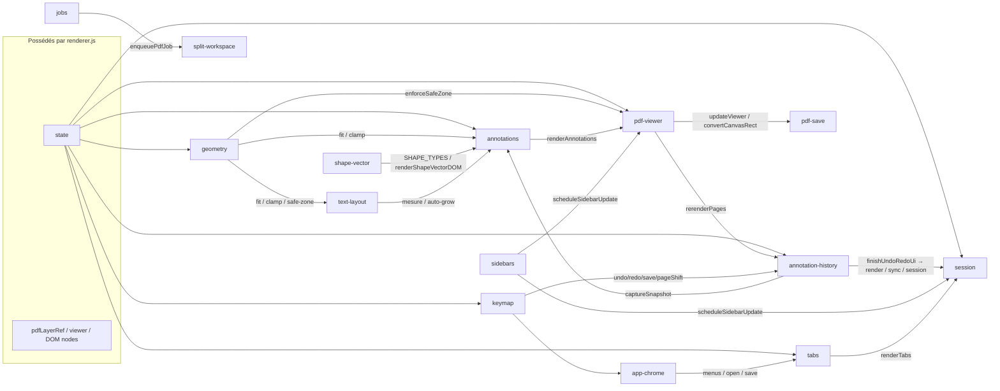
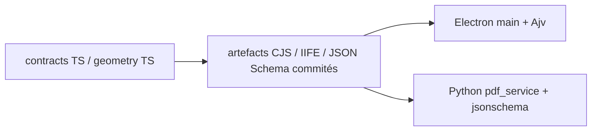

# Diagramme — dépendances modules renderer (état réel)

**Date :** 2026-07-24  
**Sources vérifiées :** `app/src/renderer/index.html` (ordre `<script>`), `app/src/renderer/renderer.js` (ordre `bind()`).  
**Non-but :** ne représente pas une architecture cible ; uniquement le câblage actuel.

## 1. Chargement scripts (`index.html`)

Ordre réel des scripts renderer (extrait ; libs vendor omises dans le schéma) :

```mermaid
flowchart TD
  subgraph load ["index.html — ordre de chargement"]
    E[renderer-error-log]
    I18N[renderer-i18n-data]
    TH[renderer-text-html]
    TC[renderer-text-ctx]
    TL[renderer-text-layout]
    AP[renderer-annotation-props]
    U[renderer-utils / toast]
    TAB[renderer-tabs]
    HIST[renderer-annotation-history]
    ANN[renderer-annotations]
    KM[renderer-keymap]
    GEO[renderer-geometry]
    SB[renderer-sidebars]
    TCM[renderer-text-ctx-menu]
    SIM[renderer-shape-image-ctx-menu]
    SV[renderer-shape-vector]
    SW[renderer-split-workspace]
    JOB[renderer-jobs]
    CHR[renderer-app-chrome]
    TT[renderer-tooltips]
    SES[renderer-session]
    PDFV[renderer-pdf-viewer]
    PDFS[renderer-pdf-save]
    ROOT[renderer.js]
  end
  E --> I18N --> TH --> TC --> TL --> AP --> U --> TAB --> HIST --> ANN --> KM --> GEO
  GEO --> SB --> TCM --> SIM --> SV --> SW --> JOB --> CHR --> TT --> SES --> PDFV --> PDFS --> ROOT
```

Note : à ce stade les IIFE s’enregistrent sur `window.__editify…` ; **aucun `bind()`** n’a encore eu lieu sauf auto-init éventuelle absente — le câblage est dans `renderer.js`.

## 2. Composition root — ordre de `bind()` (`renderer.js`)

Ordre réel des appels `*.bind(...)` (et `keymapMod.wire()`), tel que dans le fichier :

Contraintes explicites dans les commentaires du code :

- `annotationsMod.bind` **après** `historyMod.bind` (injection `captureSnapshot`).
- `sim.bind` **avant** `tcm.bind`.
- `jobs.bind` **avant** `sw.bind` (`enqueuePdfJob`).
- `pdfv.bind` après sidebars ; `session.bind` après tabs + pdfv.
- `geometryMod.bind` **avant** `textLayout.bind` (safe-zone / fit).
- `keymap` en fin (après chrome / undo / save câblés).

## 3. Dépendances runtime via `bind()` (extraits structurants)

Flèches = « A reçoit / appelle B via deps injectées » (pas d’import ESM).

### Lecture courte (F04 cœur)

| Module | Dépend surtout de (injecté) |
|--------|-----------------------------|
| **geometry** | `state` via getActiveTab, `SHAPE_TYPES`, render/sync |
| **text-layout** | geometry (safe-zone/fit), `state.editingAnnotationId`, session |
| **annotation-history** | `state`, getActiveTab, pdfv.rerenderPages, session, sync/render |
| **annotations** | history.captureSnapshot, geometry fit/clamp, text-layout, shape-vector, tcm/sim, state |
| **keymap** | history undo/redo, chrome, annotations helpers, pdfSave, tabs |

## 4. Contrats P1/P4 (hors graphe renderer, pour contexte)

Voir ADR-003. Les invariants S* restent hors schéma (ADR-005).
