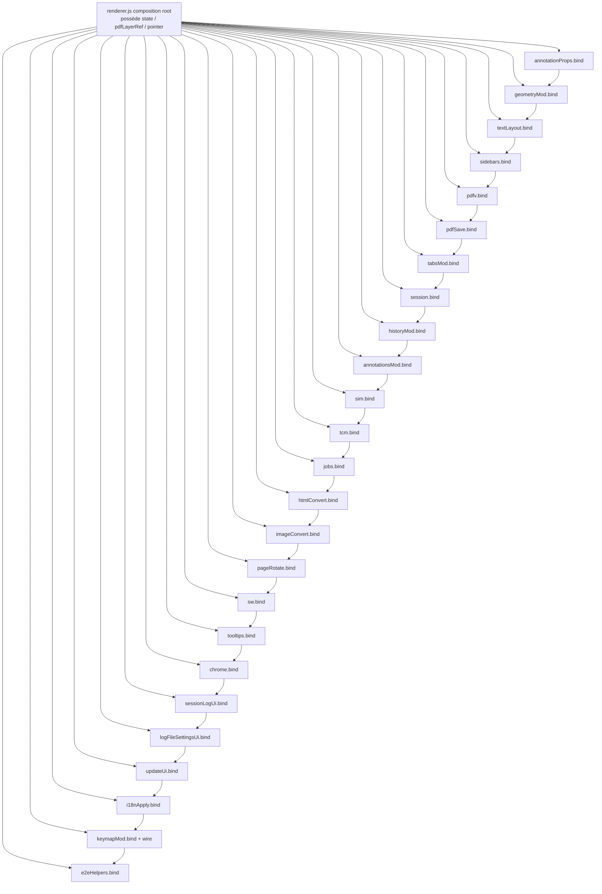
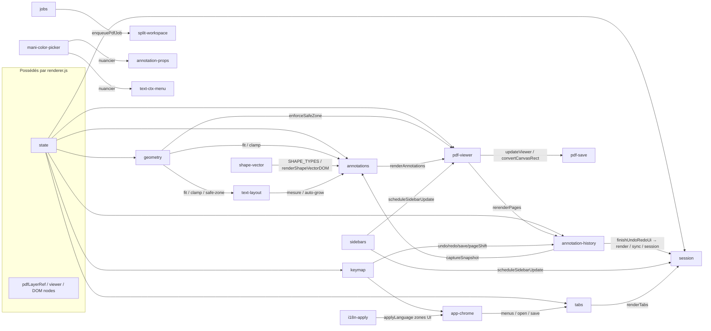
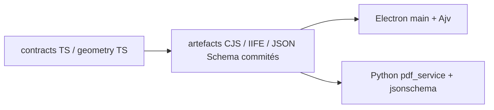

# Diagramme — dépendances modules renderer (état réel)

**Date :** 2026-07-25  
**Sources vérifiées :** `app/src/renderer/index.html` (ordre `<script>`), `app/src/renderer/renderer.js` (ordre `bind()`).  
**Non-but :** ne représente pas une architecture cible ; uniquement le câblage actuel.  
**Note post-lots complexité (1–5) :** découpages *intra*-module (`applyLanguage`, `validateJobPayload` côté main, `handleKeydown`, spell ctx, couleur) — **pas** de nouveaux fichiers `<script>` ; le graphe de chargement / `bind()` ci-dessous reste la vérité.

## 1. Chargement scripts (`index.html`)

Ordre réel des scripts renderer (libs vendor / `pdfjs-bridge` omises dans le schéma) :

```mermaid
flowchart TD
  subgraph load ["index.html — ordre de chargement"]
    E[renderer-error-log]
    FPD[floating-panel-drag]
    MCP[mani-color-picker]
    I18N[renderer-i18n-data]
    TH[renderer-text-html]
    TC[renderer-text-ctx]
    TL[renderer-text-layout]
    AP[renderer-annotation-props]
    U[renderer-utils]
    TOAST[renderer-toast]
    TAB[renderer-tabs]
    HIST[renderer-annotation-history]
    ANN[renderer-annotations]
    KM[renderer-keymap]
    GEO[renderer-geometry]
    SLOG[renderer-session-log]
    SLOGUI[renderer-session-log-ui]
    LOGSET[renderer-log-settings-ui]
    UPD[renderer-update-ui]
    SB[renderer-sidebars]
    TCM[renderer-text-ctx-menu]
    SIM[renderer-shape-image-ctx-menu]
    SV[renderer-shape-vector]
    SW[renderer-split-workspace]
    JOB[renderer-jobs]
    HTMLC[renderer-html-convert]
    IMGC[renderer-image-convert]
    PROT[renderer-page-rotate]
    CHR[renderer-app-chrome]
    TT[renderer-tooltips]
    SES[renderer-session]
    PDFV[renderer-pdf-viewer]
    PDFS[renderer-pdf-save]
    I18NA[renderer-i18n-apply]
    E2E[renderer-e2e-helpers]
    ROOT[renderer.js]
  end
  E --> FPD --> MCP --> I18N --> TH --> TC --> TL --> AP --> U --> TOAST
  TOAST --> TAB --> HIST --> ANN --> KM --> GEO --> SLOG --> SLOGUI --> LOGSET --> UPD
  UPD --> SB --> TCM --> SIM --> SV --> SW --> JOB --> HTMLC --> IMGC --> PROT
  PROT --> CHR --> TT --> SES --> PDFV --> PDFS --> I18NA --> E2E --> ROOT
```

Note : à ce stade les IIFE s’enregistrent sur `window.__editify…` ; **aucun `bind()`** n’a encore eu lieu (sauf auto-init absente) — le câblage est dans `renderer.js`.

## 2. Composition root — ordre de `bind()` (`renderer.js`)

Ordre réel des appels `*.bind(...)` (et `keymapMod.wire()`), tel que dans le fichier :

```mermaid
flowchart TD
  R[renderer.js composition root<br/>possède state / pdfLayerRef / pointer]
  R --> B1[annotationProps.bind]
  R --> B2[geometryMod.bind]
  R --> B3[textLayout.bind]
  R --> B4[sidebars.bind]
  R --> B5[pdfv.bind]
  R --> B6[pdfSave.bind]
  R --> B7[tabsMod.bind]
  R --> B8[session.bind]
  R --> B9[historyMod.bind]
  R --> B10[annotationsMod.bind]
  R --> B11[sim.bind]
  R --> B12[tcm.bind]
  R --> B13[jobs.bind]
  R --> B14[htmlConvert.bind]
  R --> B15[imageConvert.bind]
  R --> B16[pageRotate.bind]
  R --> B17[sw.bind]
  R --> B18[tooltips.bind]
  R --> B19[chrome.bind]
  R --> B20[sessionLogUi.bind]
  R --> B21[logFileSettingsUi.bind]
  R --> B22[updateUi.bind]
  R --> B23[i18nApply.bind]
  R --> B24[keymapMod.bind + wire]
  R --> B25[e2eHelpers.bind]
  B1 --> B2 --> B3 --> B4 --> B5 --> B6 --> B7 --> B8 --> B9 --> B10
  B10 --> B11 --> B12 --> B13 --> B14 --> B15 --> B16 --> B17 --> B18
  B18 --> B19 --> B20 --> B21 --> B22 --> B23 --> B24 --> B25
```

Contraintes explicites dans les commentaires du code :

- `annotationsMod.bind` **après** `historyMod.bind` (injection `captureSnapshot`).
- `sim.bind` **avant** `tcm.bind`.
- `jobs.bind` **avant** `sw.bind` (`enqueuePdfJob`).
- `pdfv.bind` après sidebars ; `session.bind` après tabs + pdfv.
- `geometryMod.bind` **avant** `textLayout.bind` (safe-zone / fit).
- `i18nApply.bind` après chrome / session-log UI (libellés DOM).
- `keymap` en fin (après chrome / undo / save câblés), puis `e2eHelpers`.

## 3. Dépendances runtime via `bind()` (extraits structurants)

Flèches = « A reçoit / appelle B via deps injectées » (pas d’import ESM).

```mermaid
flowchart LR
  subgraph root ["Possédés par renderer.js"]
    STATE[state]
    DOM[pdfLayerRef / viewer / DOM nodes]
  end

  GEO[geometry]
  TL[text-layout]
  HIST[annotation-history]
  ANN[annotations]
  PDFV[pdf-viewer]
  PDFS[pdf-save]
  SES[session]
  TABS[tabs]
  SB[sidebars]
  SV[shape-vector]
  KM[keymap]
  JOBS[jobs]
  SW[split-workspace]
  CHROME[app-chrome]
  I18NA[i18n-apply]
  AP[annotation-props]
  TCM[text-ctx-menu]
  MCP[mani-color-picker]

  STATE --> GEO
  STATE --> HIST
  STATE --> ANN
  STATE --> PDFV
  STATE --> SES
  STATE --> TABS
  STATE --> KM

  GEO -->|fit / clamp / safe-zone| TL
  GEO -->|fit / clamp| ANN
  GEO -->|enforceSafeZone| PDFV
  SV -->|SHAPE_TYPES / renderShapeVectorDOM| ANN
  HIST -->|captureSnapshot| ANN
  HIST -->|finishUndoRedoUi → render / sync / session| SES
  TL -->|mesure / auto-grow| ANN
  ANN -->|renderAnnotations| PDFV
  SB -->|scheduleSidebarUpdate| PDFV
  SB -->|scheduleSidebarUpdate| SES
  PDFV -->|updateViewer / convertCanvasRect| PDFS
  PDFV -->|rerenderPages| HIST
  TABS -->|renderTabs| SES
  JOBS -->|enqueuePdfJob| SW
  CHROME -->|menus / open / save| TABS
  KM -->|undo/redo/save/pageShift| HIST
  KM --> CHROME
  MCP -->|nuancier| AP
  MCP -->|nuancier| TCM
  I18NA -->|applyLanguage zones UI| CHROME
```

### Lecture courte (F04 cœur + lots 1–5)

| Module | Dépend surtout de (injecté) |
|--------|-----------------------------|
| **geometry** | `state` via getActiveTab, `SHAPE_TYPES`, render/sync |
| **text-layout** | geometry (safe-zone/fit), `state.editingAnnotationId`, session |
| **annotation-history** | `state`, getActiveTab, pdfv.rerenderPages, session, sync/render |
| **annotations** | history.captureSnapshot, geometry fit/clamp, text-layout, shape-vector, tcm/sim, state |
| **keymap** | history undo/redo, chrome, annotations helpers, pdfSave, tabs (sous-handlers Escape / clipboard post-lot 3) |
| **i18n-apply** | tables de bindings par zone UI (post-lot 1) |
| **annotation-props** | mani-color-picker + handlers couleur ctx/panneau (post-lots 5a/5b) |

## 4. Contrats P1/P4 (hors graphe renderer, pour contexte)

```mermaid
flowchart LR
  TS[contracts TS / geometry TS]
  ART[artefacts CJS / IIFE / JSON Schema commités]
  MAIN[Electron main + Ajv]
  PY[Python pdf_service + jsonschema]
  TS --> ART --> MAIN
  ART --> PY
```

Voir ADR-003. Les invariants S* restent hors schéma (ADR-005). Sandbox fenêtre principale : ADR-006.
